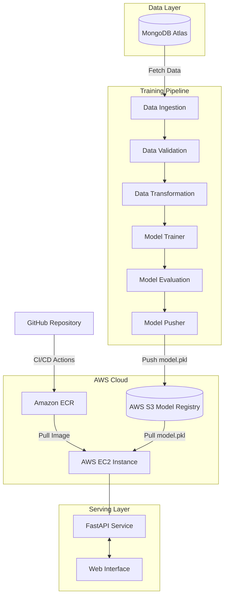

<div align="center">

# 🚗 Vehicle Insurance Prediction
### End-to-End MLOps Pipeline

*A production-grade Data Science system that predicts customer response to vehicle insurance offers — from raw MongoDB data to a live, containerized FastAPI service on AWS.*

[](https://www.python.org/)
[](https://fastapi.tiangolo.com/)
[](https://www.mongodb.com/atlas)
[](https://aws.amazon.com/)
[](https://www.docker.com/)
[](https://github.com/features/actions)
[](LICENSE)

</div>

---

## 📖 Table of Contents

- [Overview](#-overview)
- [Key Features](#-key-features)
- [System Architecture](#️-system-architecture)
- [Tech Stack](#️-tech-stack)
- [Project Structure](#-project-structure)
- [Screenshots](#-screenshots)
- [Installation & Local Setup](#️-installation--local-setup)
- [API Documentation](#-api-documentation)
- [AI/ML Pipeline Details](#-aiml-pipeline-details)
- [Complete Project Workflow](#️-complete-project-workflow)
- [CI/CD Deployment Flow](#-cicd-deployment-flow)
- [Managing the EC2 Server](#️-managing-the-ec2-server)
- [Contributing](#-contributing)
- [License](#-license)
- [Author](#-author)

---

## 🚀 Overview

The **Vehicle Insurance Prediction** system is a scalable, end-to-end machine learning architecture that predicts whether a customer will respond positively to a vehicle insurance offer.

It seamlessly transitions from raw data extraction in **MongoDB Atlas** to a production-ready **FastAPI** web service. The architecture is modularly designed to handle data validation, transformation, and model evaluation before pushing the best-performing model to an **AWS S3** model registry.

By containerizing the application with **Docker** and utilizing a **self-hosted GitHub Actions runner on AWS EC2**, the project ensures reliable, fully automated CI/CD deployments — every push to `main` results in a freshly built, tested, and deployed model in production.

---

## ✨ Key Features

| | Feature | Description |
|---|---|---|
| 🔄 | **Automated Data Pipeline** | Custom data ingestion from MongoDB Atlas into a structured Pandas DataFrame |
| 🏗️ | **Production-Grade Training** | Modular pipeline covering data validation (`schema.yaml`), transformation, training & evaluation |
| ☁️ | **Cloud Model Registry** | Automated push/pull of serialized `model.pkl` artifacts via AWS S3 (`boto3`) |
| ⚡ | **RESTful API Inference** | High-performance model serving with FastAPI + Uvicorn |
| 🚢 | **Continuous Deployment** | Automated Docker builds pushed to Amazon ECR and deployed via a self-hosted EC2 runner |
| 🔐 | **Secrets-Driven Config** | All credentials (Mongo, AWS) injected via environment variables / GitHub Secrets — nothing hardcoded |

---

## 🏗️ System Architecture



---

## 🛠️ Tech Stack

| Category | Technology | Purpose |
|---|---|---|
| **Language** | Python 3.12 | Core programming language |
| **Backend / API** | FastAPI, Uvicorn | High-performance inference serving |
| **Database** | MongoDB Atlas | Centralized remote data storage |
| **Data Science** | Pandas, Scikit-Learn | Data manipulation and predictive modeling |
| **Cloud Storage** | AWS S3 | Artifact and model registry |
| **Containerization** | Docker, Amazon ECR | Application containerization and image registry |
| **Compute** | AWS EC2 (Ubuntu 24.04) | Self-hosted GitHub Actions runner + app host |
| **CI/CD** | GitHub Actions | Automated build, push & deploy pipeline |

---

## 📁 Project Structure

```
vehicle-insurance/
├── .github/workflows/
│   └── aws.yaml                 # CI/CD pipeline configuration
├── notebook/
│   ├── mongoDB_demo.ipynb       # Database connection tests
│   └── eda_feature_engg.ipynb   # Exploratory data analysis
├── src/
│   ├── components/              # Core pipeline steps (Ingestion, Validation, etc.)
│   ├── configuration/           # MongoDB & AWS connection configs
│   ├── data_access/              # DB → DataFrame access layer
│   ├── entity/                  # Config, Artifact, and AWS S3 Estimator definitions
│   ├── pipeline/                # training_pipeline.py and prediction_pipeline.py
│   ├── utils/                    # Helper functions (main_utils.py)
│   ├── logger/                   # Custom logging module
│   ├── exception/                # Custom exception handling
│   └── constants/                # Environment and project constants
├── static/                      # Frontend assets (CSS)
├── templates/                   # Jinja2 HTML templates
├── Dockerfile                   # Docker image blueprint
├── .dockerignore
├── app.py                       # FastAPI application entry point
├── demo.py                      # Local pipeline testing script
├── setup.py                     # Local package installation setup
├── pyproject.toml               # Build system & package config
└── requirements.txt              # Python dependencies
```

---

## 📸 Screenshots

<div align="center">

### 🌐 1. Application User Interface
*FastAPI Web Interface for entering vehicle and customer data*<br>


### 🎯 2. Real-Time Prediction Output
*Model successfully processing form data and returning a prediction status*<br>


### 💻 3. MLOps Codebase
*Modularized training pipeline architecture inside VS Code*<br>


### ☁️ 4. AWS EC2 Server
*Live Ubuntu instance successfully running the deployed application*<br>


### 🐳 5. Amazon ECR (Elastic Container Registry)
*Docker images successfully pushed via CI/CD pipeline*<br>


### 🗄️ 6. AWS S3 Model Registry
*The `model.pkl` artifact safely stored in the cloud after evaluation*<br>


### ⚙️ 7. GitHub Actions Runner
*Self-hosted EC2 runner actively listening for continuous deployment triggers*<br>


</div>

---

## ⚙️ Installation & Local Setup

### 1. Prerequisites

- Python 3.10 installed
- A MongoDB Atlas account and connection string
- AWS account with S3 and ECR configured

### 2. Clone and Setup Environment

```bash
# Clone the repository
git clone https://github.com/YourUsername/vehicle-insurance.git
cd vehicle-insurance

# Create and activate a Conda environment
conda create -n vehicle python=3.10 -y
conda activate vehicle

# Install dependencies and local packages
pip install -r requirements.txt

# Verify local packages installed correctly
pip list
```

### 3. Environment Variables

Set the following as environment variables (or in a `.env` file):

**Bash**
```bash
export MONGODB_URL="mongodb+srv://<username>:<password>@cluster..."
export AWS_ACCESS_KEY_ID="your_aws_access_key"
export AWS_SECRET_ACCESS_KEY="your_aws_secret_key"
export AWS_DEFAULT_REGION="us-east-1"
export ECR_REPO="vehicleproj"
```

**PowerShell**
```powershell
$env:MONGODB_URL="mongodb+srv://<username>:<password>@cluster..."
$env:AWS_ACCESS_KEY_ID="your_aws_access_key"
$env:AWS_SECRET_ACCESS_KEY="your_aws_secret_key"
```

> ⚠️ Make sure the `artifact/` directory is added to `.gitignore` — it's regenerated on every pipeline run and shouldn't be committed.

### 4. Run the Application

```bash
python app.py
```

Access the web interface at **http://localhost:5080** (or your configured port).

---

## 📡 API Documentation

| Method | Endpoint | Description |
|---|---|---|
| `GET` | `/` | Renders the HTML form for user input |
| `POST` | `/` | Accepts form data, preprocesses it, and returns a prediction (`Response-Yes` / `Response-No`) |
| `GET` | `/train` | Triggers the complete MLOps training pipeline asynchronously |

---

## 🧠 AI/ML Pipeline Details

1. **Data Ingestion**
   Reads real-time data from MongoDB Atlas, converts key-value pairs into Pandas DataFrames, and performs train-test splits.

2. **Data Validation**
   Validates schema, column count, and data types against a predefined `schema.yaml`.

3. **Data Transformation**
   Applies scaling/encoding through a custom `estimator.py`, producing model-ready feature sets.

4. **Model Trainer**
   Trains a Scikit-Learn model on the transformed data and serializes it as `model.pkl`.

5. **Model Evaluation**
   Compares the newly trained model against the existing S3 model using an `EVALUATION_CHANGED_THRESHOLD_SCORE` of **0.02**.

6. **Model Pusher**
   If the new model outperforms the existing one, `model.pkl` is pushed to the S3 bucket `vehicle-insurance-mlops-proj1` under `MODEL_PUSHER_S3_KEY = "model-registry"`.

---

## 🗺️ Complete Project Workflow

<details>
<summary><strong>🧩 1. Project Scaffolding & Local Packages</strong></summary>

1. Generate the project skeleton by running `template.py`.
2. Configure `setup.py` and `pyproject.toml` so local packages (`src/`) can be imported as an installable module.
3. Create and activate a Conda virtual environment:
   ```bash
   conda create -n vehicle python=3.10 -y
   conda activate vehicle
   ```
4. Add all dependencies to `requirements.txt`, then install:
   ```bash
   pip install -r requirements.txt
   ```
5. Confirm local packages are installed correctly with `pip list`.

</details>

<details>
<summary><strong>🍃 2. MongoDB Atlas Setup</strong></summary>

1. Sign up for MongoDB Atlas and create a new project.
2. Create a cluster using the free **M0** tier with default settings.
3. Set up a database username and password.
4. Under **Network Access**, whitelist `0.0.0.0/0` for access from anywhere.
5. Grab the **connection string** from *Connect → Drivers → Python 3.6+*, and save it (with the password filled in).
6. Create a `notebook/` directory, add `mongoDB_demo.ipynb`, and select the `vehicle` conda environment as the kernel.
7. Load the dataset into the notebook and push it to MongoDB.
8. Verify the upload in **Atlas → Database → Browse Collections** — data appears in key-value (JSON) format.

</details>

<details>
<summary><strong>🧾 3. Logging, Exceptions & EDA</strong></summary>

1. Implement a custom logger and validate it via `demo.py`.
2. Implement a custom exception handler and validate it via `demo.py`.
3. Perform Exploratory Data Analysis and feature engineering in a dedicated notebook.

</details>

<details>
<summary><strong>📥 4. Data Ingestion Component</strong></summary>

1. Declare pipeline-wide variables in `constants/__init__.py`.
2. Implement `configuration/mongo_db_connections.py` for the MongoDB connection function.
3. In `data_access/`, add `proj1_data.py` to fetch data via the Mongo connection and convert it into a DataFrame.
4. Build out `entity/config_entity.py` up to `DataIngestionConfig`.
5. Build out `entity/artifact_entity.py` up to `DataIngestionArtifact`.
6. Implement `components/data_ingestion.py` and wire it into `training_pipeline.py`.
7. Set the `MONGODB_URL` environment variable, then run `demo.py` to test.

</details>

<details>
<summary><strong>🧪 5. Data Validation, Transformation & Model Trainer</strong></summary>

1. Complete `utils/main_utils.py` and fully define `config/schema.yaml` with dataset metadata for validation.
2. Build the **Data Validation** component following the same pattern as Data Ingestion.
3. Build the **Data Transformation** component (adds an `estimator.py` to `entity/`).
4. Build the **Model Trainer** component (extends the class in `entity/estimator.py`).

</details>

<details>
<summary><strong>☁️ 6. AWS Setup for Model Evaluation & Registry</strong></summary>

1. Log in to the AWS Console and set the region to `us-east-1`.
2. Go to **IAM → Create User** (e.g. `firstproj`) and attach the `AdministratorAccess` policy.
3. Generate a CLI **Access Key** for the user and download the credentials CSV.
4. Export the credentials as environment variables:
   ```bash
   export AWS_ACCESS_KEY_ID="AWS_ACCESS_KEY_ID"
   export AWS_SECRET_ACCESS_KEY="AWS_SECRET_ACCESS_KEY"
   ```
5. Add the access key, secret key, and region to `constants/__init__.py`, including:
   ```python
   MODEL_EVALUATION_CHANGED_THRESHOLD_SCORE: float = 0.02
   MODEL_BUCKET_NAME = "my-model-mlopsproj"
   MODEL_PUSHER_S3_KEY = "model-registry"
   ```
6. Implement `src/configuration/aws_connection.py` to talk to AWS S3.
7. Create an S3 bucket: **Region:** `us-east-1` → General purpose → Name: `vehicle-insurance-mlops-proj1` → uncheck *Block all public access*.
8. Implement `src/aws_storage/` for push/pull logic, and `entity/s3_estimator.py` for the S3 model I/O functions.

</details>

<details>
<summary><strong>🔮 7. Model Evaluation, Model Pusher & Serving</strong></summary>

1. Build the **Model Evaluation** and **Model Pusher** components.
2. Scaffold the **Prediction Pipeline** and set up `app.py`.
3. Add the `static/` and `templates/` directories for the web frontend.

</details>

<details>
<summary><strong>🐳 8. CI/CD — Docker, ECR, EC2 & GitHub Actions</strong></summary>

1. Add a `Dockerfile` and `.dockerignore` to the project root.
2. Create `.github/workflows/aws.yaml` for the CI/CD pipeline.
3. Create a second IAM user (e.g. `usvisa-user`) the same way as before, and generate its access keys.
4. Create an **ECR repository** (`vehicleproj`) in `us-east-1` to store the Docker image — copy the repo URI.
5. Launch an **EC2 instance**:
   - Name: `vehicledata-machine`
   - AMI: Ubuntu Server 24.04 (Free Tier)
   - Type: `t3.small`
   - New key pair: `proj1key`
   - Allow HTTP + HTTPS traffic, 30 GB storage
   - Connect via **EC2 Instance Connect**
6. Install Docker on the EC2 instance:
   ```bash
   sudo apt-get update -y
   sudo apt-get upgrade -y

   curl -fsSL https://get.docker.com -o get-docker.sh
   sudo sh get-docker.sh
   sudo usermod -aG docker ubuntu
   newgrp docker
   ```
7. Register the EC2 instance as a **self-hosted GitHub Actions runner**:
   - GitHub repo → **Settings → Actions → Runners → New self-hosted runner**
   - Select Linux, then run the *Download* and *Configure* commands on the EC2 terminal
   - Accept defaults for runner group/name/labels/work folder
   - Run `./run.sh` to connect — confirm the runner shows as **Idle** in GitHub
8. Add the following **GitHub Secrets** (`Settings → Secrets and variables → Actions`):
   - `AWS_ACCESS_KEY_ID`
   - `AWS_SECRET_ACCESS_KEY`
   - `AWS_DEFAULT_REGION`
   - `ECR_REPO`
9. Push a commit — the CI/CD pipeline triggers automatically.
10. Open **port 5000** on the EC2 security group: *Security → Security Groups → Edit inbound rules → Custom TCP → 5000 → 0.0.0.0/0*.
11. Visit `http://<EC2-PUBLIC-IP>:5080` to see the app live. Trigger retraining anytime via the `/train` route.

</details>

---

## 🔁 CI/CD Deployment Flow


---

## 🖥️ Managing the EC2 Server

Since EC2 billing is usage-based, it's good practice to stop the instance when not in use.

### ⏸️ Pausing the Server (Stop Billing)
1. AWS Console → **EC2 Dashboard → Instances**
2. Select your instance → **Instance state → Stop instance**
3. ⚠️ Never click **Terminate instance** — that deletes it permanently.

### ▶️ Resuming the Server
1. AWS Console → **EC2 Dashboard → Instances**
2. Select your instance → **Instance state → Start instance**
3. Wait ~60 seconds for it to fully boot.

### ✅ "Back to Work" Checklist
1. Copy the new **Public IPv4 address** (AWS assigns a new one on every restart).
2. Reconnect via SSH:
   ```bash
   ssh -i "your-key.pem" ubuntu@<NEW_IP>
   ```
3. Restart the container:
   ```bash
   docker start fastapi-app
   ```
   *(or simply push a new commit to trigger the CI/CD pipeline)*
4. View the live app at `http://<NEW_IP>:5000`.

---

## 🤝 Contributing

Contributions are welcome! Please fork the repository and submit a pull request for any enhancements or bug fixes.

1. Fork the project
2. Create your feature branch (`git checkout -b feature/AmazingFeature`)
3. Commit your changes (`git commit -m 'Add some AmazingFeature'`)
4. Push to the branch (`git push origin feature/AmazingFeature`)
5. Open a Pull Request

---

## 📄 License

This project is licensed under the **MIT License** — see the [LICENSE](LICENSE) file for details.

---

## 👨‍💻 Author

**Piyush Chauhan**
*Data Scientist & Backend Engineer*

<div align="center">

⭐ If you found this project useful, consider giving it a star on GitHub!

</div>