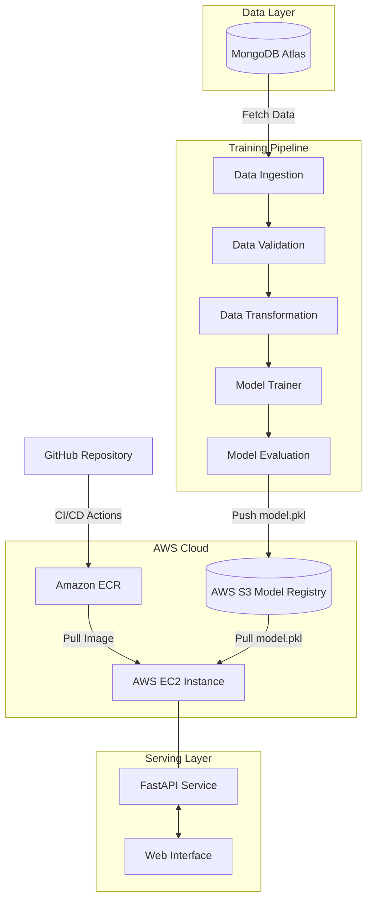
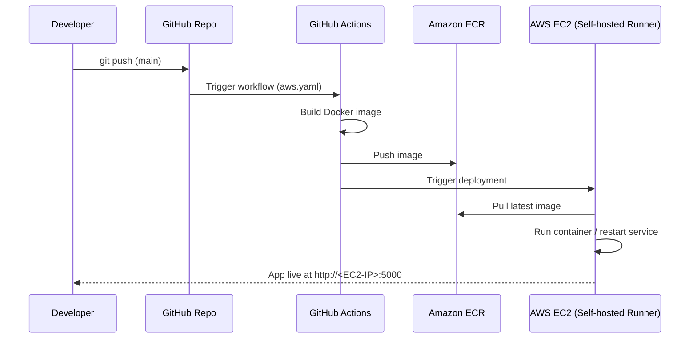

<div align="center">

# 🚗 Vehicle Insurance Prediction
### End-to-End MLOps Pipeline

*A production-grade Data Science system that predicts customer response to vehicle insurance offers — from raw MongoDB data to a live, containerized FastAPI service on AWS.*

[](https://www.python.org/)
[](https://fastapi.tiangolo.com/)
[](https://www.mongodb.com/atlas)
[](https://aws.amazon.com/)
[](https://www.docker.com/)
[](https://github.com/features/actions)
[](LICENSE)

</div>

---

## 📖 Table of Contents

- [Overview](#-overview)
- [Key Features](#-key-features)
- [System Architecture](#️-system-architecture)
- [Tech Stack](#️-tech-stack)
- [Project Structure](#-project-structure)
- [Screenshots](#-screenshots)
- [Installation & Local Setup](#️-installation--local-setup)
- [API Documentation](#-api-documentation)
- [AI/ML Pipeline Details](#-aiml-pipeline-details)
- [CI/CD Deployment Flow](#-cicd-deployment-flow)
- [Contributing](#-contributing)
- [License](#-license)
- [Author](#-author)

---

## 🚀 Overview

The **Vehicle Insurance Prediction** system is a scalable, end-to-end machine learning architecture that predicts whether a customer will respond positively to a vehicle insurance offer.

It seamlessly transitions from raw data extraction in **MongoDB Atlas** to a production-ready **FastAPI** web service. The architecture is modularly designed to handle data validation, transformation, and model evaluation before pushing the best-performing model to an **AWS S3** model registry.

By containerizing the application with **Docker** and utilizing a **self-hosted GitHub Actions runner on AWS EC2**, the project ensures reliable, fully automated CI/CD deployments — every push to `main` results in a freshly built, tested, and deployed model in production.

---

## ✨ Key Features

| | Feature | Description |
|---|---|---|
| 🔄 | **Automated Data Pipeline** | Custom data ingestion from MongoDB Atlas into a structured Pandas DataFrame |
| 🏗️ | **Production-Grade Training** | Modular pipeline covering data validation (`schema.yaml`), transformation, training & evaluation |
| ☁️ | **Cloud Model Registry** | Automated push/pull of serialized `model.pkl` artifacts via AWS S3 (`boto3`) |
| ⚡ | **RESTful API Inference** | High-performance model serving with FastAPI + Uvicorn |
| 🚢 | **Continuous Deployment** | Automated Docker builds pushed to Amazon ECR and deployed via a self-hosted EC2 runner |

---

## 🏗️ System Architecture



---

## 🛠️ Tech Stack

| Category | Technology | Purpose |
|---|---|---|
| **Language** | Python 3.10 | Core programming language |
| **Backend / API** | FastAPI, Uvicorn | High-performance inference serving |
| **Database** | MongoDB Atlas | Centralized remote data storage |
| **Data Science** | Pandas, Scikit-Learn | Data manipulation and predictive modeling |
| **Cloud Storage** | AWS S3 | Artifact and model registry |
| **Containerization** | Docker, Amazon ECR | Application containerization and image registry |
| **Deployment** | AWS EC2, GitHub Actions | Self-hosted runner for continuous deployment |

---

## 📁 Project Structure

```
vehicle-insurance/
├── .github/workflows/
│   └── aws.yaml                 # CI/CD pipeline configuration
├── notebook/
│   ├── mongoDB_demo.ipynb       # Database connection tests
│   └── eda_feature_engg.ipynb   # Exploratory data analysis
├── src/
│   ├── components/              # Core pipeline steps (Ingestion, Validation, etc.)
│   ├── entity/                  # Config, Artifact, and AWS S3 Estimator definitions
│   ├── pipeline/                # training_pipeline.py and prediction_pipeline.py
│   ├── utils/                   # Helper functions (main_utils.py)
│   └── constants/                # Environment and project constants
├── static/                      # Frontend assets (CSS)
├── templates/                   # Jinja2 HTML templates
├── Dockerfile                   # Docker image blueprint
├── app.py                       # FastAPI application entry point
├── setup.py                     # Local package installation setup
└── requirements.txt             # Python dependencies
```

---

## 📸 Screenshots

<div align="center">

### 🔷 FastAPI Web Interface
*Input form for customer & vehicle attributes*

### 🔷 Prediction Result
*Live prediction output — `Response-Yes` / `Response-No`*

### 🔷 AWS Deployment
*EC2 instance running the app · ECR image registry · S3 model registry*

</div>

> 💡 Add your screenshots to an `assets/` or `images/` folder in the repo and embed them like:
> ``

---

## ⚙️ Installation & Local Setup

### 1. Prerequisites

- Python 3.10 installed
- A MongoDB Atlas account and connection string
- AWS account with S3 and ECR configured

### 2. Clone and Setup Environment

```bash
# Clone the repository
git clone https://github.com/YourUsername/vehicle-insurance.git
cd vehicle-insurance

# Create and activate a Conda environment
conda create -n vehicle python=3.10 -y
conda activate vehicle

# Install dependencies and local packages
pip install -r requirements.txt
```

### 3. Environment Variables

Create a `.env` file in the root directory and configure the following:

```env
MONGODB_URL="mongodb+srv://<username>:<password>@cluster..."
AWS_ACCESS_KEY_ID="your_aws_access_key"
AWS_SECRET_ACCESS_KEY="your_aws_secret_key"
AWS_DEFAULT_REGION="us-east-1"
ECR_REPO="vehicleproj"
```

### 4. Run the Application

```bash
python app.py
```

Access the web interface at **http://localhost:5080** (or your configured port).

---

## 📡 API Documentation

| Method | Endpoint | Description |
|---|---|---|
| `GET` | `/` | Renders the HTML form for user input |
| `POST` | `/` | Accepts form data, preprocesses it, and returns a prediction (`Response-Yes` / `Response-No`) |
| `GET` | `/train` | Triggers the complete MLOps training pipeline asynchronously |

---

## 🧠 AI/ML Pipeline Details

1. **Data Ingestion**
   Reads real-time data from MongoDB Atlas, converts key-value pairs into Pandas DataFrames, and performs train-test splits.

2. **Validation & Transformation**
   Enforces data integrity via a predefined `schema.yaml` and applies scaling/encoding through a custom `estimator.py`.

3. **Model Registry**
   Compares newly trained models against the existing S3 model using an `EVALUATION_CHANGED_THRESHOLD_SCORE` of **0.02**. If the new model performs better, `model.pkl` is pushed to the S3 bucket `vehicle-insurance-mlops-proj1`.

---

## 🔁 CI/CD Deployment Flow



---

## 🤝 Contributing

Contributions are welcome! Please fork the repository and submit a pull request for any enhancements or bug fixes.

1. Fork the project
2. Create your feature branch (`git checkout -b feature/AmazingFeature`)
3. Commit your changes (`git commit -m 'Add some AmazingFeature'`)
4. Push to the branch (`git push origin feature/AmazingFeature`)
5. Open a Pull Request

---

## 📄 License

This project is licensed under the **MIT License** — see the [LICENSE](LICENSE) file for details.

---

## 👨‍💻 Author

**Piyush Chauhan**
*Data Scientist & Backend Engineer*

<div align="center">

⭐ If you found this project useful, consider giving it a star on GitHub!

</div>